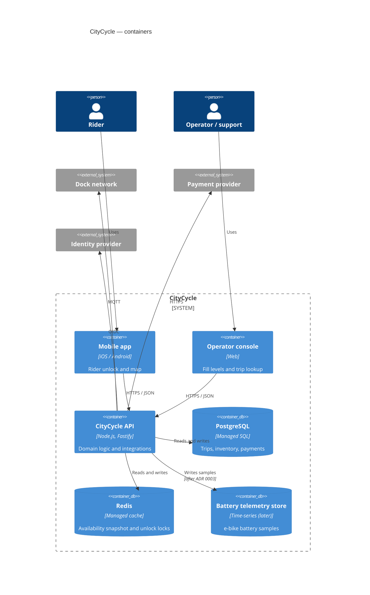
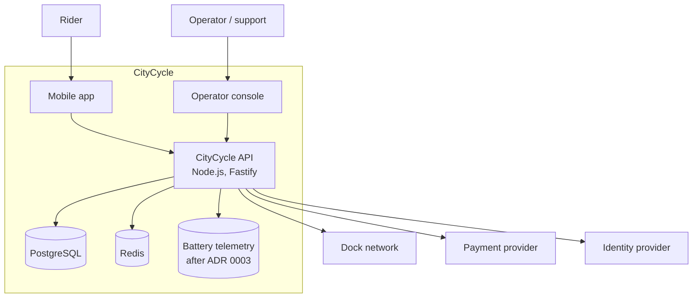

# C4 — Containers

Deployable pieces inside CityCycle after the founding ADRs. The API is the Node.js process from ADR 0004. Battery telemetry storage from ADR 0003 is shown as a later addition.

```mermaid
C4Container
  title CityCycle — containers

  Person(rider, "Rider")
  Person(staff, "Operator / support")

  System_Boundary(citycycle, "CityCycle") {
    Container(mobile, "Mobile app", "iOS / Android", "Rider unlock and map")
    Container(console, "Operator console", "Web", "Fill levels and trip lookup")
    Container(api, "CityCycle API", "Node.js, Fastify", "Domain logic and integrations")
    ContainerDb(pg, "PostgreSQL", "Managed SQL", "Trips, inventory, payments")
    ContainerDb(redis, "Redis", "Managed cache", "Availability snapshot and unlock locks")
    ContainerDb(telemetry, "Battery telemetry store", "Time-series (later)", "e-bike battery samples")
  }

  System_Ext(docks, "Dock network")
  System_Ext(payments, "Payment provider")
  System_Ext(idp, "Identity provider")

  Rel(rider, mobile, "Uses")
  Rel(staff, console, "Uses")
  Rel(mobile, api, "HTTPS / JSON")
  Rel(console, api, "HTTPS / JSON")
  Rel(api, pg, "Reads and writes")
  Rel(api, redis, "Reads and writes")
  Rel(api, telemetry, "Writes samples", "after ADR 0003")
  Rel(api, docks, "MQTT")
  Rel(api, payments, "HTTPS")
  Rel(api, idp, "OIDC")
```

```mermaid
flowchart TB
  rider["Rider"]
  staff["Operator / support"]

  subgraph citycycle["CityCycle"]
    mobile["Mobile app"]
    console["Operator console"]
    api["CityCycle API<br/>Node.js, Fastify"]
    pg[("PostgreSQL")]
    redis[("Redis")]
    telemetry[("Battery telemetry<br/>after ADR 0003")]
  end

  docks["Dock network"]
  payments["Payment provider"]
  idp["Identity provider"]

  rider --> mobile --> api
  staff --> console --> api
  api --> pg
  api --> redis
  api --> telemetry
  api --> docks
  api --> payments
  api --> idp
```
