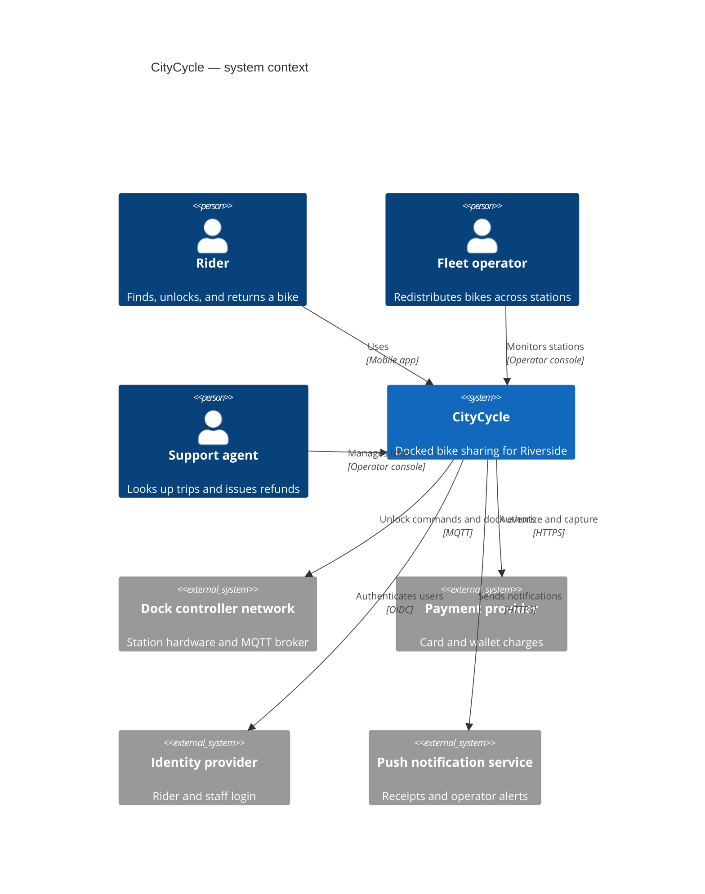
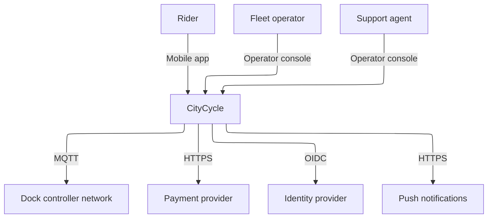

# C4 — System context

CityCycle and its neighbors. The system of interest is one box. Everything else is a person or an external system.

```mermaid
C4Context
  title CityCycle — system context

  Person(rider, "Rider", "Finds, unlocks, and returns a bike")
  Person(operator, "Fleet operator", "Redistributes bikes across stations")
  Person(support, "Support agent", "Looks up trips and issues refunds")

  System(citycycle, "CityCycle", "Docked bike sharing for Riverside")

  System_Ext(docks, "Dock controller network", "Station hardware and MQTT broker")
  System_Ext(payments, "Payment provider", "Card and wallet charges")
  System_Ext(idp, "Identity provider", "Rider and staff login")
  System_Ext(push, "Push notification service", "Receipts and operator alerts")

  Rel(rider, citycycle, "Uses", "Mobile app")
  Rel(operator, citycycle, "Monitors stations", "Operator console")
  Rel(support, citycycle, "Manages trips", "Operator console")
  Rel(citycycle, docks, "Unlock commands and dock events", "MQTT")
  Rel(citycycle, payments, "Authorize and capture", "HTTPS")
  Rel(citycycle, idp, "Authenticates users", "OIDC")
  Rel(citycycle, push, "Sends notifications", "HTTPS")
```

```mermaid
---
config:
  layout: elk
---
flowchart TB
  rider["Rider"]
  operator["Fleet operator"]
  support["Support agent"]
  citycycle["CityCycle"]
  docks["Dock controller network"]
  payments["Payment provider"]
  idp["Identity provider"]
  push["Push notifications"]

  rider -->|Mobile app| citycycle
  operator -->|Operator console| citycycle
  support -->|Operator console| citycycle
  citycycle -->|MQTT| docks
  citycycle -->|HTTPS| payments
  citycycle -->|OIDC| idp
  citycycle -->|HTTPS| push
```
